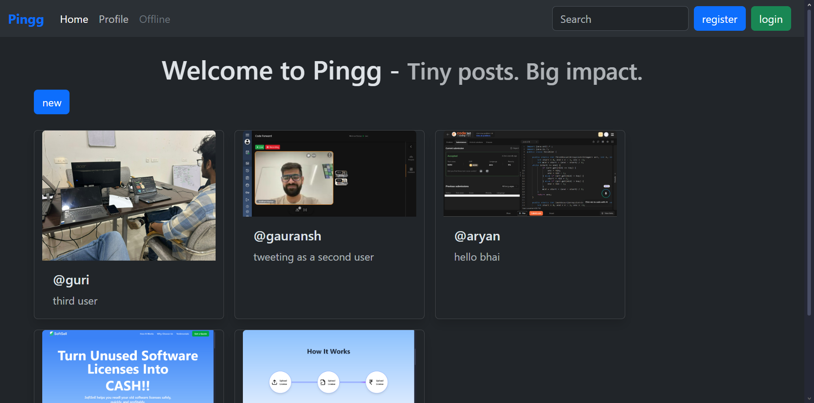
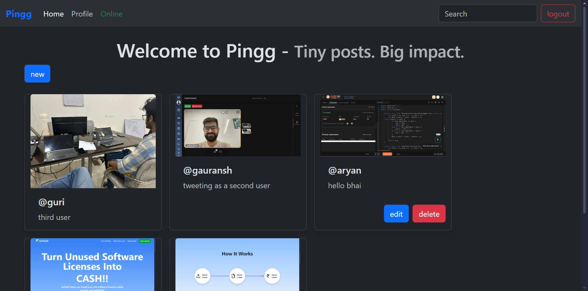
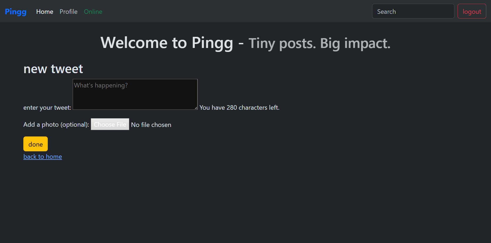

# Pingg 🐦  
*A simple, minimalistic tweet-like web application built with Django.*

---

## 📑 Table of Contents

- [About](#about)
- [Features](#features)
- [Screenshots](#screenshots)
- [Installation](#installation)
- [Usage](#usage)
- [Technologies Used](#technologies-used)
- [What I Learned](#what-i-learned)

---

## 📌 About

**Pingg** is a lightweight clone of a microblogging platform. Users can:
- Register & log in
- Create, edit, and delete posts (tweets)
- Upload photos with tweets
- See a list of all tweets

---

## ✨ Features

✅ User authentication (login, register, logout)  
✅ Tweet CRUD (Create, Read, Update, Delete)  
✅ Upload images with tweets  
✅ Bootstrap-powered responsive UI  
✅ Search input for future expansion  

---

## 📷 Screenshots

| Home | Tweet List | New Tweet |
|------|-------------|------------|
|  |  |  |

---

## 🚀 Installation

Follow these steps to run **Pingg** locally:

1️⃣ **Clone the repo**

```bash
git clone https://github.com/yourusername/pingg.git
cd pingg
```

2️⃣ **Create and activate virtual environment**

```bash
# Windows PowerShell
python -m venv .venv
.venv\Scripts\Activate.ps1

# Or Linux/macOS
python3 -m venv .venv
source .venv/bin/activate
```

3️⃣ **Install dependencies**

```bash
pip install -r requirements.txt
```

4️⃣ Run migrations

```bash
python manage.py migrate
```
5️⃣ **Create a superuser (optional)**

```bash
python manage.py createsuperuser
```

6️⃣ **Run the server**

```bash
python manage.py runserver
```

7️⃣ **Visit**

```bash
Open http://127.0.0.1:8000 in your browser.
```

---

## 🛠️ Technologies Used

- Python 3.12
- Django 5.x
- HTML, CSS (Bootstrap)
- SQLite (default Django DB)

---

## 📚 What I Learned
- ✅ How to set up and structure a Django project
- ✅ Creating models, forms, and views in Django
- ✅ Handling user authentication and permissions
- ✅ Using Django's template engine and static files
- ✅ Organizing URLs and using namespace for reverse URL lookups
- ✅ Working with Media files (user-uploaded images)
- ✅ Using virtual environments and .gitignore properly
- ✅ Deploying a Django app (recommended: Vercel or Render)

---

## 🍵 Future Ideas
- Proper search feature
- Personal profile
- Better UI and hero page
- Real time chat feature using Kafka

---
